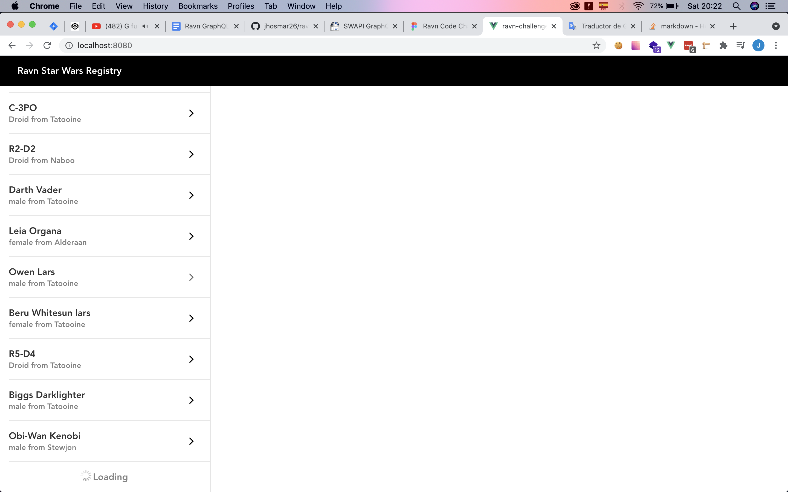
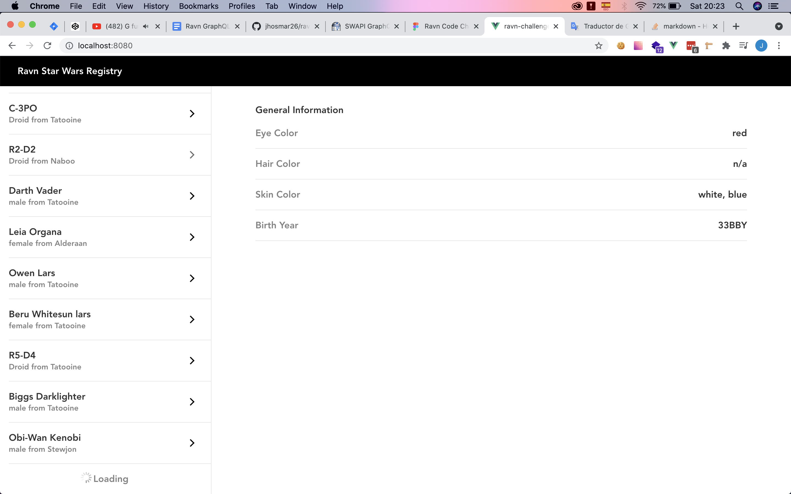
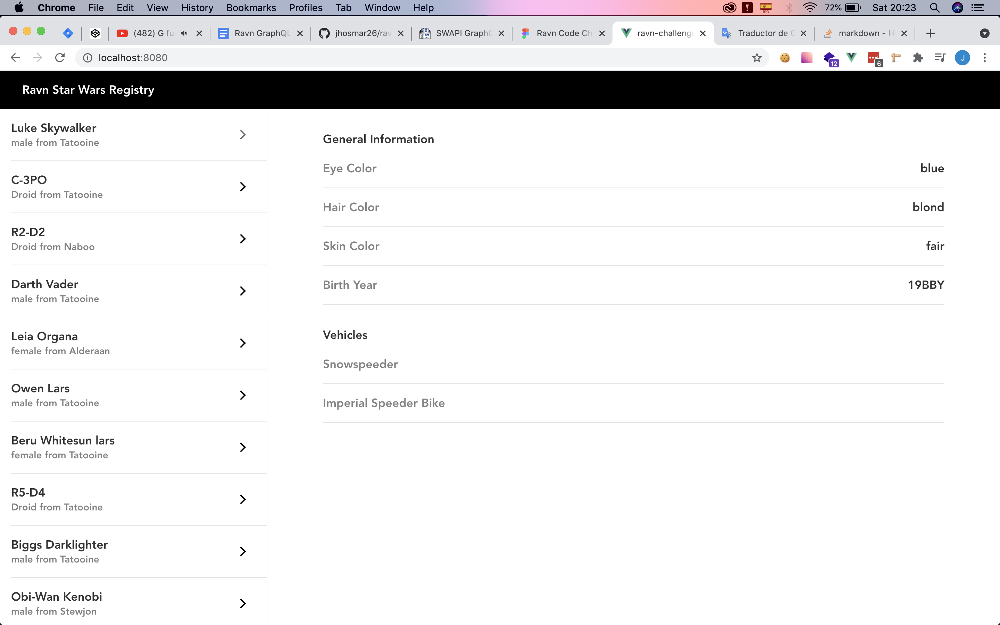

# ravn-challenge-v2-jhose-portillo

This project is a layout which consume data from an external GRAPHQL API of Star Wars characters.

## Project setup
```
npm install
```

### Compiles and hot-reloads for development
```
npm run serve
```
## At the beginning the app load 5 items and it iterates until the parent element height becomes higher than the clients screen.


## If you pick any Star Wars character, the Person information will be showed in the right side of the screen.


## Also you can notice that if the person doesn't have vehicles that Component wont be showed.


For this project I used the next technologies:
* VueJS
* GraphQl
* Apollo